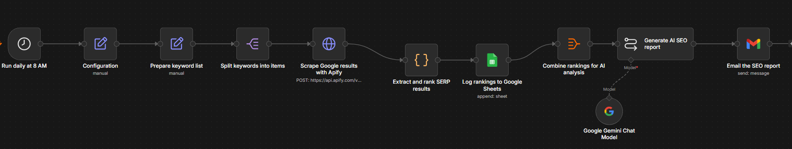
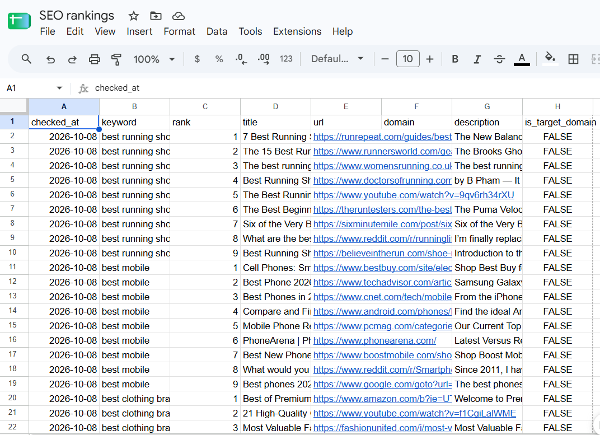
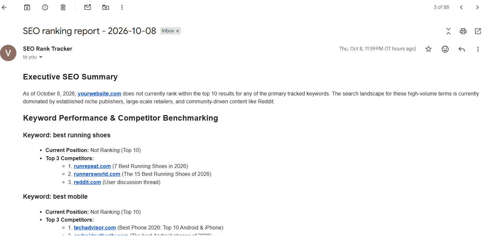

# AI SEO Ranking Automation

Track keyword rankings on Google every day with **n8n + Apify**, log them to **Google Sheets**, and receive an **AI-written SEO report** by email.



## Problem

Checking where your website ranks on Google is slow and manual. Rankings change daily, nobody keeps a history, and raw positions don't tell you what to do next. Small teams and agencies often skip SEO tracking or pay for expensive tools.

## Solution

This n8n workflow automates the whole loop:

1. Runs every day at 8 AM.
2. Scrapes Google results for your keywords through Apify.
3. Extracts and ranks each result, flagging your domain.
4. Logs every row to Google Sheets to build a ranking history.
5. Sends all rankings to an LLM, which writes a short SEO report.
6. Emails the report to you as clean HTML.

## Features

- Scheduled daily tracking, no manual checks
- One **Configuration** node for all settings (keywords, target domain, country, language, AI model, report email)
- Country- and language-specific Google results
- Per-keyword data: rank, title, URL, domain, description, `is_target_domain`
- Historical ranking log in Google Sheets
- AI report: your domain's position, top competitors, 3-5 prioritized opportunities
- HTML email delivery via Gmail

## Architecture

```
Schedule Trigger (8 AM daily)
        |
Configuration
        |
Prepare keyword list
        |
Split keywords into items
        |
Apify Google Search Scraper (HTTP POST)
        |
Extract and rank SERP results (Code)
        |
Log rankings to Google Sheets
        |
Combine rankings for AI analysis
        |
Generate AI SEO report  <-- Google Gemini Chat Model
        |
Email the SEO report (Gmail)
```

| Component | Purpose |
|-----------|---------|
| n8n | Workflow orchestration |
| Apify | Google Search Scraper actor |
| Google Sheets | Ranking history |
| Google Gemini | Report generation |
| Gmail | Report delivery |

## Setup

### Prerequisites
- An n8n instance (cloud or self-hosted)
- An [Apify](https://apify.com) account and API token
- A Google account (Sheets and Gmail OAuth)
- A Google Gemini API key

### Steps

1. **Import the workflow:** in n8n, *Workflows -> Import from File* and select `workflow.json`.
2. **Create credentials** in n8n (none are included in this repo):
   - Apify API token (Header Auth: `Authorization: Bearer YOUR_TOKEN`)
   - Google Sheets OAuth2
   - Gmail OAuth2
   - Google Gemini (PaLM) API key
3. **Create a Google Sheet** with these headers in row 1:
   `date | keyword | rank | title | url | domain | description | is_target_domain`
4. **Edit the Configuration node:** `keywords` (comma-separated), `target_domain`, `country`, `language`, `ai_model`, `report_email`.
5. **Select your credentials** on the Apify, Google Sheets, Gemini, and Gmail nodes, and choose your spreadsheet in the Sheets node.
6. **Test** with *Execute Workflow*, check the sheet and your inbox, then **activate** the workflow.

## Screenshots

| Workflow | Google Sheets log | AI email report |
|---|---|---|
|  |  |  |

## Security

`workflow.json` contains no credentials or secrets. Add your own keys through n8n's credential manager.

## Credits

Based on the n8n template *Track keyword rankings on Google with Apify and send AI SEO reports by email*.
